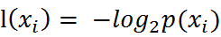
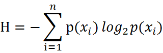
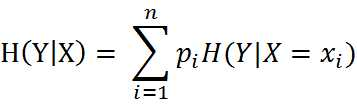
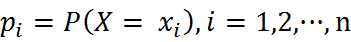
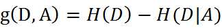
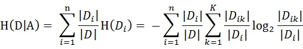

# 决策树

## 引言

- 决策树是什么？决策树(decision tree)是一种基本的分类与回归方法。

- 我们可以把决策树看成一个if-then规则的集合，将决策树转换成if-then规则的过程是这样的：由决策树的根结点(root node)到叶结点(leaf node)的每一条路径构建一条规则；路径上内部结点的特征对应着规则的条件，而叶结点的类对应着规则的结论。决策树的路径或其对应的if-then规则集合具有一个重要的性质：互斥并且完备。这就是说，每一个实例都被一条路径或一条规则所覆盖，而且只被一条路径或一条规则所覆盖。这里所覆盖是指实例的特征与路径上的特征一致或实例满足规则的条件

## 决策树的构建过程

- 收集数据:可以使用任何方法。根据他们考虑的因素和最终的选择结果，就可以得到一些供我们利用的数据了。

- 准备数据：收集完的数据，我们要进行整理，将这些所有收集的信息按照一定规则整理出来，并排版，方便我们进行后续处理。

- 分析数据：可以使用任何方法，决策树构造完成之后，我们可以检查决策树图形是否符合预期。

- 训练算法：这个过程也就是构造决策树，同样也可以说是决策树学习，就是构造一个决策树的数据结构。

- 测试算法：使用经验树计算错误率。当错误率达到了可接收范围，这个决策树就可以投放使用了。

- 使用算法：此步骤可以使用适用于任何监督学习算法，而使用决策树可以更好地理解数据的内在含义。

## 决策树的构建的准备工作

1. 特征选取
    
    特征选择在于选取对训练数据具有分类能力的特征。这样可以提高决策树学习的效率，如果利用一个特征进行分类的结果与随机分类的结果没有很大差别，则称这个特征是没有分类能力的。经验上扔掉这样的特征对决策树学习的精度影响不大。通常特征选择的标准是信息增益(information gain)或信息增益比。

    什么是信息增益呢？在划分数据集之后信息发生的变化称为信息增益，知道如何计算信息增益，我们就可以计算每个特征值划分数据集获得的信息增益，获得信息增益最高的特征就是最好的选择。

    - 香农熵
        
        在可以评测哪个数据划分方式是最好的数据划分之前，我们必须学习如何计算信息增益。集合信息的度量方式称为香农熵或者简称为熵(entropy)，这个名字来源于信息论之父克劳德·香农。

        熵定义为信息的期望值。在信息论与概率统计中，熵是表示随机变量不确定性的度量。如果待分类的事物可能划分在多个分类之中，则符号xi的信息定义为 ：

        

        其中p(xi)是选择该分类的概率。通过上式，我们可以得到所有类别的信息。为了计算熵，我们需要计算所有类别所有可能值包含的信息期望值(数学期望)，通过下面的公式得到：

        

        期中n是分类的数目。熵越大，随机变量的不确定性就越大。
    
    - 编写代码计算经验熵

        在编写代码之前，我们先对数据集进行属性标注

    - 信息增益

        在上面，我们已经说过，如何选择特征，需要看信息增益。也就是说，信息增益是相对于特征而言的，信息增益越大，特征对最终的分类结果影响也就越大，我们就应该选择对最终分类结果影响最大的那个特征作为我们的分类特征。

        条件熵:条件熵H(Y|X)表示在已知随机变量X的条件下随机变量Y的不确定性，随机变量X给定的条件下随机变量Y的条件熵(conditional entropy)H(Y|X)，定义为X给定条件下Y的条件概率分布的熵对X的数学期望

        

        

        同理，当条件熵中的概率由数据估计(特别是极大似然估计)得到时，所对应的条件熵称为条件经验熵(empirical conditional entropy)

        明确了条件熵和经验条件熵的概念。前面也提到了，信息增益是相对于特征而言的。所以，特征A对训练数据集D的信息增益g(D,A)，定义为集合D的经验熵H(D)与特征A给定条件下D的经验条件熵H(D|A)之差，即

        

        一般地，熵H(D)与条件熵H(D|A)之差称为互信息(mutual information)。决策树学习中的信息增益等价于训练数据集中类与特征的互信息。

        设特征A有n个不同的取值{a1,a2,···,an}，根据特征A的取值将D划分为n个子集{D1,D2，···,Dn}，|Di|为Di的样本个数。记子集Di中属于Ck的样本的集合为Dik，即Dik = Di ∩ Ck，|Dik|为Dik的样本个数。于是经验条件熵的公式可以些为

        

        反正就是就是一个计算谁的信息增益值最大，把最大的选为最优特征。

2. 决策树生成和修建

    - 由于在之前的步骤中，我们已经可以知道要采用递归的方式进行数据集的划分，知道不能继续下去位置，但对于未知的测试数据的分类没那么准确，即可能会出现拟合现象。拟合的原因在于学习时过多地考虑如何提高对训练数据的正确分类，从而导致决策树过于复杂。因为在允许的情况下，我们需要的对已生成的决策树进行简化。

    - 构建决策树的方法很多，这里使用了ID3算法

        - ID3算法的核心是在决策树各个结点上对应信息增益准则选择特征，递归地构建决策树。具体方法是：从根结点(root node)开始，对结点计算所有可能的特征的信息增益，选择信息增益最大的特征作为结点的特征，由该特征的不同取值建立子节点；再对子结点递归地调用以上方法，构建决策树；直到所有特征的信息增益均很小或没有特征可以选择为止。最后得到一个决策树。ID3相当于用极大似然法进行概率模型的选择。

3. 决策树的存储

    构造决策树是很耗时的任务，即使处理很小的数据集，如前面的样本数据，也要花费几秒的时间，如果数据集很大，将会耗费很多计算时间。然而用创建好的决策树解决分类问题，则可以很快完成。因此，为了节省计算时间，最好能够在每次执行分类时调用已经构造好的决策树。

4. 关于代码实现

    - 使用了Sklearn构建决策树
    - Graphviz画图
        - 使用gini来选择最优划分属性

5. 总结

    - 优点

        - 易于理解和解释。决策树可以可视化。

        - 几乎不需要数据预处理。其他方法经常需要数据标准化，创建虚拟变量和删除缺失值。决策树还不支持缺失值。

        - 使用树的花费（例如预测数据）是训练数据点(data points)数量的对数。

        - 可以同时处理数值变量和分类变量。其他方法大都适用于分析一种变量的集合。

        - 可以处理多值输出变量问题。

        - 使用白盒模型。如果一个情况被观察到，使用逻辑判断容易表示这种规则。相反，如果是黑盒模型（例如人工神经网络），结果会非常难解释。

        - 即使对真实模型来说，假设无效的情况下，也可以较好的适用。

    - 缺点

         - 决策树学习可能创建一个过于复杂的树，并不能很好的预测数据。也就是过拟合。

         - 决策树可能是不稳定的，因为即使非常小的变异，可能会产生一颗完全不同的树。

         - 概念难以学习，因为决策树没有很好的解释他们。

         - 如果某些分类占优势，决策树将会创建一棵有偏差的树。